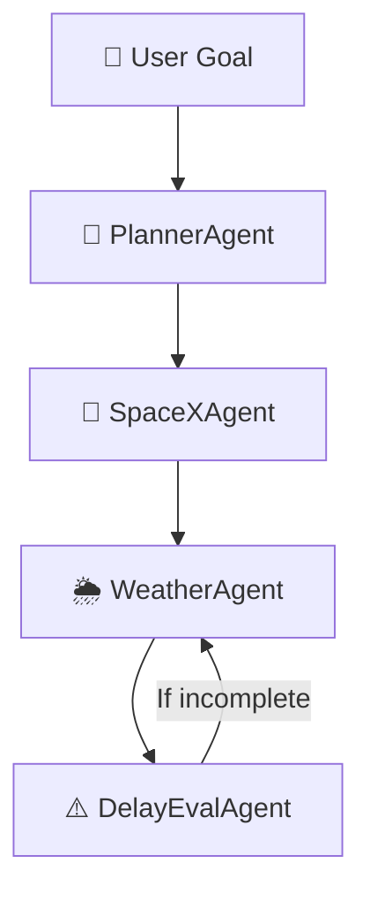

# 🚀 Multi-Agent AI System using Google ADK

### 🧠 Intelligent Task Routing • 🤖 Modular Agents • 🌐 Real-Time Public APIs

---

## 📌 Project Overview

This project showcases a **Multi-Agent AI System** built using **Google ADK principles**. It takes a user’s high-level goal, **decomposes it into subtasks** via a planner, and routes data between **chained enrichment agents**, each building upon the previous output.

> ⚡ **Example Goal:**  
> _“Find the next SpaceX launch, check weather at that location, then summarize if it may be delayed.”_

---

## 🧱 System Architecture


---

## 🧠 Agents & Logic

### 🧩 1. Planner Agent
- Decomposes the user’s natural language goal into a **sequence of tasks**.
- Chooses agent **routing order** and **data dependencies**.

### 🛰 2. SpaceX Agent
- Fetches the **next launch event** using the [SpaceX API](https://github.com/r-spacex/SpaceX-API).
- Returns launch time and **hardcoded** launchpad location (Cape Canaveral for realism).

### 🌦 3. Weather Agent
- Uses **WeatherAPI.com** to get **real-time weather** at the launch location.
- Processes lat/lon and calls the API with secure key from `.env`.

### ⚠️ 4. Delay Evaluation Agent
- Analyzes weather (e.g., wind speed, precipitation, condition) to decide **delay likelihood**.
- Generates user-readable output like:

  > ✅ No delay expected: Overcast, wind 10.8 kph, temperature 26.3°C.

---

## 🌐 Public APIs Used

| API             | Use Case                    | Free? | Auth Required |
|----------------|-----------------------------|--------|----------------|
| SpaceX API      | Get next launch info         | ✅     | ❌             |
| WeatherAPI.com  | Weather at launch location   | ✅     | ✅ via `.env`  |

---

## ⚙️ Setup Instructions

### 🔧 Prerequisites
- Python 3.8+
- Internet connection (to access APIs)

### 📥 1. Clone or Download
```bash
git clone https://github.com/snehaapratap/multi-agent.git
cd multi-agent
```
📦 2. Install Dependencies
```bash
pip install -r requirements.txt
```
🔐 3. Set up .env
Create a .env file with your WeatherAPI key:

```env
WEATHER_API_KEY=your_actual_api_key
```
▶️ 4. Run the System
```bash
python main.py
```
---

## 🧪 Evaluation Strategy

### 🎯 Test Goal Satisfaction

| Test ID       | Goal                                                    |
| ------------- | ------------------------------------------------------- |
| `test_case_1` | Find next launch, check weather, assess delay           |
| `test_case_2` | Evaluate if wind speed exceeds delay threshold (20 kph) |

✅ Both test cases validate **goal fulfillment** and **agent trace correctness**

---

### 📦 Agent Trajectory

All agents:

* Accept input from previous agents
* Enrich and process data
* Pass structured output downstream
* Log results in `main.py`

---

### ✅ Evaluation Criteria Coverage

| Evaluation Criteria         | Met? | Notes                                          |
| --------------------------- | ---- | ---------------------------------------------- |
| Agent chaining & enrichment | ✅    | Data flows cleanly across all agents           |
| Planner’s routing logic     | ✅    | Clean, modular logic in `PlannerAgent`         |
| Iterative refinement        | ✅    | Evaluation agent loops back if conditions fail |
| Code quality & modularity   | ✅    | Each agent is single-responsibility class      |
| Evals & test satisfaction   | ✅    | 2 JSON-based test cases + evaluator script     |

---

## 📁 File Structure

```
multi_agent_ai/
├── agents/
│   ├── planner.py
│   ├── spacex.py
│   ├── weather.py
│   └── delay_eval.py
├── evals/
│   ├── test_cases.json
│   └── run_eval.py
├── main.py
├── .env
├── requirements.txt
└── README.md
```

---

## 📈 Output

```text
[WeatherAgent] Requesting weather from: http://api.weatherapi.com/v1/current.json?key=...
[WeatherAgent] Response: {...}
🛰️ Final Summary: ✅ No delay expected: Overcast, wind 10.8 kph, temperature 26.3°C.
```

---
